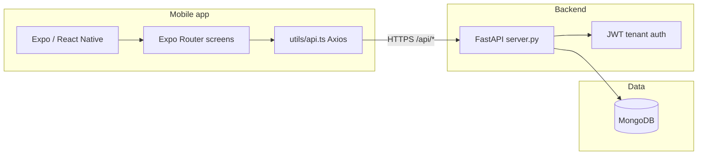

# Smart Rent App Pilot — Guide for Junior Developers

This document explains what the **smart-rent-app-pilot** repository is, how the pieces fit together, and where to look when you need to change something. It assumes you know basic JavaScript/TypeScript and Python, but not this codebase.

---

## What is this project?

**SmartRent** (in this repo) is a **tenant-facing mobile app** aimed at the Kenyan rental market. Tenants can:

- Log in and see a **home dashboard** (rent status, quick actions, snippets of tickets and payments).
- **Pay rent** via a flow that mimics M-Pesa (the backend **simulates** confirmation after a few seconds).
- Open and track **maintenance tickets**, with optional photos.
- Browse **documents**: lease, deposit info, notices.
- Use **More / settings** for profile, password, and support-style sections.

The app is **not** a full property-management admin tool; it is the **tenant** experience only. Demo data is **seeded** into the database on backend startup so you can log in immediately.

---

## Big picture: how the pieces talk



- **Frontend** (`frontend/`): React Native with **Expo SDK 54**, **Expo Router** (file-based routes), **Axios** for HTTP.
- **Backend** (`backend/`): **FastAPI** single file `server.py`, **Motor** (async MongoDB driver), **JWT** for tenants, **bcrypt** for passwords.
- **Database**: **MongoDB**. Collection names include `tenants`, `units`, `leases`, `payments`, `maintenance_tickets`, `notifications`.

---

## Repository layout (what lives where)

Below is the **meaningful** structure. When you run the app, you may also see `node_modules/`, `.metro-cache/`, and Python `__pycache__/` — those are generated; do not commit them.

```
smart-rent-app-pilot/
├── README.md                    # Minimal placeholder at repo root
├── design_guidelines.json       # UI/UX tokens: colors, fonts, stack notes
├── memory/
│   └── PRD.md                   # Product requirements summary (screens + API list)
├── frontend/                    # Expo React Native app
│   ├── app/                     # Routes (Expo Router)
│   │   ├── _layout.tsx          # Root: fonts, AuthProvider, stack, SSE toasts
│   │   ├── index.tsx            # Login / “Find a home” (auth screen)
│   │   └── (app)/               # Logged-in area
│   │       ├── _layout.tsx      # Bottom tabs: Home, Tickets, Docs, More
│   │       ├── (home)/          # Dashboard, notices, pay rent
│   │       ├── (tickets)/       # List + create maintenance tickets
│   │       ├── (docs)/          # Lease, deposit, doc hub
│   │       └── (more)/          # Settings / profile sections
│   ├── context/
│   │   └── AuthContext.tsx      # Login, logout, token + tenant in memory + AsyncStorage
│   ├── utils/
│   │   └── api.ts               # Axios instance: base URL, Bearer token, 401 cleanup
│   ├── constants/
│   │   └── Colors.ts            # Aligns with design_guidelines.json
│   ├── assets/                  # Images, fonts
│   ├── app.json                 # Expo config (scheme, plugins, icons)
│   ├── package.json             # Scripts: expo start, android, ios, web
│   ├── .env.example             # Template for EXPO_PUBLIC_BACKEND_URL
│   └── .env                     # Local overrides (not in git — see .gitignore)
├── backend/
│   ├── server.py                # All API routes, models, seed, SSE bus
│   ├── requirements.txt         # Python dependencies (runtime + pytest)
│   ├── .env.example             # Template for Mongo + JWT secrets
│   └── .env                     # MONGO_URL, DB_NAME, JWT secrets (not in git)
├── backend/tests/
│   └── test_tenant_apis.py      # Pytest integration tests against a running API
├── tests/
│   └── __init__.py              # Placeholder package (root-level tests folder)
├── test_reports/                # Optional folder for CI/pytest artifacts (.gitkeep only by default)
├── test_result.md               # Short pointer for how to run API tests
├── .githooks/                   # Optional commit-msg cleanup (see scripts/enable-git-hooks.sh)
└── scripts/                     # Repo helper scripts
```

---

## Frontend in more detail

### Routing (Expo Router)

- Files under `frontend/app/` define **URLs** and **navigation**.
- **`app/index.tsx`**: login screen. If `AuthContext` already has a tenant, it **redirects** to `/(app)/(home)`.
- **`app/_layout.tsx`**: wraps the app in `SafeAreaProvider` and `AuthProvider`, loads **Plus Jakarta Sans** and **DM Sans**, shows a loading splash until fonts load, and defines a **Stack** with `index` and `(app)`.
- **`app/(app)/_layout.tsx`**: **Tabs** — Home `(home)`, Tickets `(tickets)`, Docs `(docs)`, More `(more)`.

Parentheses in folder names like `(app)` are **route groups**: they organize files without adding a segment to the URL in the way a normal folder would. The Expo docs explain this well; search “Expo Router groups”.

### Authentication

- **`context/AuthContext.tsx`** stores `tenant` and `token`, persists them with **AsyncStorage** keys `tenant_token` and `tenant_data`.
- **`utils/api.ts`** reads `tenant_token` on each request and sets `Authorization: Bearer …`. On **401**, it clears stored auth (session expired or invalid).

### API base URL

- All REST calls use `process.env.EXPO_PUBLIC_BACKEND_URL` + `/api`.
- In Expo, variables exposed to the client must be prefixed with **`EXPO_PUBLIC_`**.

### Real-time (SSE)

- **`app/_layout.tsx`** includes a `ToastOverlay` that opens an **SSE** connection to `/api/realtime/events?type=tenant` when the user has a token.
- On **native** only (not web), it listens for events such as `payment:confirmed` and shows a toast.
- The backend publishes to an in-memory **EventBus** (for example after the simulated M-Pesa confirmation).

### Design consistency

- **`design_guidelines.json`**: intended typography, colors, and stack (e.g. `StyleSheet.create`, Reanimated).
- **`constants/Colors.ts`**: use these in components so the app stays on-brand.

---

## Backend in more detail

### Single entry point

- **`backend/server.py`** is the whole HTTP API: app creation, CORS, Mongo connection, Pydantic request models, routes, seeding, and SSE.

### Environment variables (typical)

| Variable | Role |
|----------|------|
| `MONGO_URL` | MongoDB connection string (**required**) |
| `DB_NAME` | Database name (defaults to `smartrent_db` if unset) |
| `JWT_SECRET` | Present in code; tenant flows use `TENANT_JWT_SECRET` |
| `TENANT_JWT_SECRET` | Signs and verifies **tenant** JWTs |

Set these in `backend/.env`. Never commit real secrets.

### API prefix

- Routes are mounted on **`/api`** (see `APIRouter(prefix="/api")`).
- Example: health check is **`GET /api/health`**, not `/health`.

### Tenant authentication

- Login verifies email/password against `tenants` in Mongo; password field is `tenantPassword` (bcrypt).
- Account must have **`tenantActivated`: true** (seed user is pre-activated).
- Responses include a JWT signed with **`TENANT_JWT_SECRET`**. Protected routes use **`Depends(get_current_tenant)`**, which expects `Authorization: Bearer <token>`.

### Main domain areas (collections)

| Collection | Purpose |
|------------|---------|
| `tenants` | Tenant profile, unit link, hashed password, activation flags |
| `units` | Unit metadata, rent amount |
| `leases` | Active lease, dates, deposit, monthly rent |
| `payments` | History; initiate creates pending then simulated confirm |
| `maintenance_tickets` | Tickets created by tenant |
| `notifications` | In-app notices; some created by payment/ticket flows |

### Seed data

- On **`startup`**, if no tenant with `grace.muthoni@gmail.com` exists, the server inserts demo **unit**, **tenant**, **lease**, **payments**, **tickets**, and **notifications**.
- **Demo login**: email `grace.muthoni@gmail.com`, password `password123` (see `memory/PRD.md`).

### Simulated behaviors (important for juniors)

- **M-Pesa**: `POST /api/tenant/payments/initiate` creates a pending payment; a background task confirms it after ~3 seconds and can push an SSE event.
- **SSE**: Infrastructure is real; not every possible event type may be emitted by seed data, but payment confirmation is wired.

---

## How to run things locally (typical workflow)

1. **MongoDB**: Run an instance locally or use Atlas, and put the connection string in `backend/.env` as `MONGO_URL`.
2. **Backend**:
   - Create a virtualenv, `pip install -r backend/requirements.txt`.
   - From `backend/`, run something like: `uvicorn server:app --reload --host 0.0.0.0 --port 8000` (exact command may vary with your setup).
3. **Frontend**:
   - In `frontend/`, `yarn` or `npm install`.
   - Set `EXPO_PUBLIC_BACKEND_URL` in `frontend/.env` to your API base **without** trailing `/api` (the client appends `/api`).
   - `yarn start` or `npx expo start`, then open iOS simulator, Android emulator, or Expo Go.

If the app cannot reach the backend, check device vs machine networking (e.g. use your LAN IP instead of `localhost` when testing on a physical phone).

---

## Testing

- **`backend/tests/test_tenant_apis.py`**: **pytest** tests that call a **live** server using `requests`. They read `EXPO_PUBLIC_BACKEND_URL` from `frontend/.env` at the **repository root**, or from the `EXPO_PUBLIC_BACKEND_URL` environment variable.
- **`test_reports/`**: may contain exported pytest XML or iteration JSON for CI or agents.

---

## Where to read next

| Goal | Start here |
|------|----------------|
| Product scope and endpoint list | `memory/PRD.md` |
| Visual / brand rules | `design_guidelines.json` + `frontend/constants/Colors.ts` |
| Add or change an API | `backend/server.py` |
| Add or change a screen | Matching file under `frontend/app/` |
| Change how login or tokens work | `frontend/context/AuthContext.tsx` + `backend/server.py` (auth section) |

---

## Glossary

- **Expo**: Toolkit and cloud services around React Native; this project uses the managed workflow with **Expo Router**.
- **FastAPI**: Modern Python web framework; automatic OpenAPI docs are usually at `/docs` when the server runs.
- **Motor**: Async MongoDB driver used inside FastAPI async route handlers.
- **SSE**: Server-Sent Events; one-way stream from server to client over HTTP, used here for lightweight real-time toasts.

Welcome to the codebase — trace a feature end-to-end once (for example “Pay rent”) by following the screen → `api.post`/`api.get` in the screen file → matching route in `server.py` → Mongo collection. That pattern repeats everywhere.
